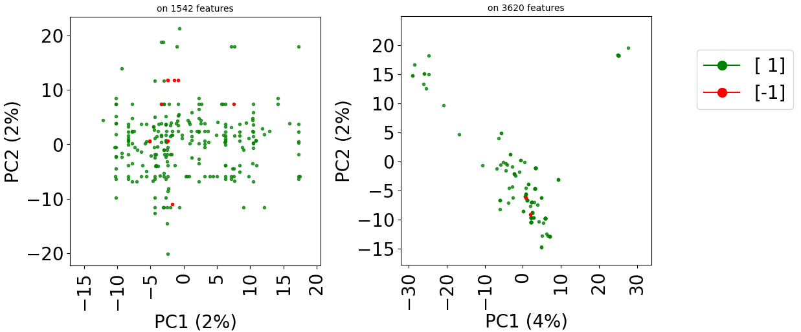

Getting started with *stanscofi*
-----------------------------------

Introduction
::::::::::::::::

The following section is an introduction to the functionalities of *stanscofi*. It is also available as an interactive `notebook <https://github.com/RECeSS-EU-Project/stanscofi/blob/master/docs/Introduction%20to%20stanscofi.ipynb>`_. The Python package *stanscofi* proposes standard procedures to train, and to validate drug repurposing classifiers, along with assessing and visualizing their performance. It comprises method-agnostic training and validation procedures on several drug repurposing datasets present in the literature. 

The proper implementation of these steps is crucial in order to avoid data leakage, *i*.*e*., when the model is learnt over information that should be unavailable at prediction time. This can avoided by building training and validation sets which are weakly correlated with respect to the drug and disease feature vectors (function ``weakly_correlated_split`` in module *stanscofi.training_testing*). The main performance metric is the area under the curve (AUC), which estimates the diagnostic ability of a recommender system better than accuracy in imbalanced datasets, and the :math:`F_\beta` score (function ``compute_metrics`` in module *stanscofi.validation*). Since version 2.0.0, other ranking measures are implemented.

Let's create the folder containing the datasets: ::

  $ mkdir -p datasets/
  
and import base librairies and off we go: ::

 import numpy as np
 import pandas as pd
 from time import time
 from scipy.sparse import coo_array 
 import stanscofi
 random_state = 124565
 np.random.seed(random_state)
 
**Note 1:** As a general rule, all functions are documented, so one can check out the inputs and outputs of a function func by typing: ::

 help(func)
 
**Note 2:** To mesure your environmental impact when using this package (in terms of carbon emissions), please run the following command: ::

 $ codecarbon init

to initialize the CodeCarbon config. For more information about using CodeCarbon, please refer to the `official repository <https://github.com/mlco2/codecarbon>`__.

Handling a *stanscofi.Dataset* 
:::::::::::::::::::::::::::::::

A dataset for collaborative filtering-based drug repurposing comprises three matrices:

- A matrix filled with 0, 1, or -1 values, which represents the known associations between drugs and diseases. Typically, 1 (resp., -1) stands for a positive (resp., negative) drug-disease matching. Finally, 0 represents unknown (untested) drug-disease matchings.

- A matrix which encodes selected features for every drug involved in at least one matching in the previous matrix. Drug features might be the similarity of its chemical structure to the ones of other drugs, or the variation in gene activity which can be imputed to the treatment by that drug.

- A matrix which similarly encodes features for every disease involved in at least one matching in the previous matrix. In that case, features of a disease might correspond to the similarity of its associated phenotypes (i.e., observable characteristics associated with the disease), or the variation in gene activity which can be imputed to the presence of disease.

A dataset class with valuable methods (for the import and visualization) is implemented in *stanscofi.datasets*. The import of several drug repurposing datasets is implemented in *stanscofi.utils* (see `this GitHub repository <https://github.com/RECeSS-EU-Project/drug-repurposing-datasets>`_ for more information about the datasets). 

This section shows how to use these methods. ::

 import stanscofi.datasets
 import stanscofi.utils

Building a *stanscofi.Dataset* from existing datasets
======================================================

The first option to create a *stanscofi.Dataset* is to import a known drug repurposing dataset and convert it into a  *stanscofi.Dataset*. The available ones are shown in the following table:

.. list-table:: Available datasets in *stanscofi*
   :widths: 25 25 25 25 25 25
   :header-rows: 1
   
   * - Dataset
     - #drugs★ (#features)
     - #diseases★ (#features)
     - #positive matchings
     - #negative matchings
     - Sparsity number✦
   * - Gottlieb / FDataset
     - 593 (593)
     - 313 (313) 
     - 1,933 
     -  0   
     - 98.96%
   * - CDataset
     - 663 (663)
     - 409 (409)
     -  2,532 
     -  0    
     - 99.07%
   * - DNDataset
     - 550 (1,490)
     - 360 (4,516) 
     - 1,008 
     - 0  
     - 99.50%
   * - LRSSL
     - 763 (2,049)
     - 681 (681)
     - 3,051  
     - 0 
     - 99.41%
   * - PREDICT-Gottlieb
     - 593 (1,779) 
     - 313 (313)
     - 1,933 
     -  0  
     - 98.96%
   * - TRANSCRIPT
     - 204 (12,096) 
     - 116 (12,096) 
     -  401 
     -  11 
     - 98.26%
   * - PREDICT (private version)
     - 1,351 (6,265)
     - 1,066 (2,914) 
     - 5,624 
     - 152
     - 99.60%

★ involved in at least one known drug-disease matching
✦ percentage of unknown matchings in the drug-disease association matrix (note that it takes into account *all* diseases and drugs in the dataset, even those which are not involved with any known matching)

Note that for PREDICT, per default, the downloaded version is the partial dataset publicly available on Zenodo. If the notebook *PREDICT_dataset.ipynb* in `this repository <https://github.com/RECeSS-EU-Project/drug-repurposing-datasets>`_ was not run, then function *load_dataset* will return a dataset with the following characteristics:

.. list-table:: Public version of the PREDICT dataset
   :widths: 25 25 25 25 25 25
   :header-rows: 1

   * - Dataset
     - #drugs★ (#features)
     - #diseases★ (#features)
     - #positive matchings
     - #negative matchings
     - Sparsity number✦   
   * - PREDICT (public version)
     - 1,014 (1,642)
     - 941 (1,490) 
     - 4,627
     - 132
     - 99.50%
     
Those datasets can be retrieved using the following names: ::

 available_datasets = ["Gottlieb", "Cdataset", "DNdataset", "LRSSL", 
     "PREDICT_Gottlieb", "TRANSCRIPT", "PREDICT"]
 
Printing the contents of the datasets should match the contents of the previous table. ::

 for model_name in available_datasets:
    print("$ "+model_name)
    data_args = stanscofi.utils.load_dataset(model_name, save_folder="../datasets/")
    dataset = stanscofi.datasets.Dataset(**data_args)
    # Prints the summary of the dataset
    dataset.summary() 
    
Build a *stanscofi.Dataset* from a custom dataset
======================================================

The second option to create a *stanscofi.Dataset* is to build one from scratch, using a matrix of ratings, a drug ("item") feature matrix and a disease ("user") feature matrix. Method ``.summary`` returns several measures of interest for the dataset (see ``help``). ::

 di = stanscofi.utils.load_dataset("TRANSCRIPT", save_folder="../datasets/")

 ratings = di["ratings"]
 users = di["users"]
 items = di["items"]

 for df_name in ["ratings", "users", "items"]:
     print("$ "+df_name)
     print(eval(df_name).iloc[:5,:5])
     if (df_name=="ratings"):
         print("Values %s" % str(np.unique(eval(df_name).values)))
     print("Shape (%d, %d)" % eval(df_name).shape, "\n")

 dataset = stanscofi.datasets.Dataset(ratings=ratings, users=users, items=items, 
        same_item_user_features=True, name="TRANSCRIPT <custom loading>")
 print("$ "+dataset.name)
 dataset.summary()
 
Visualization with a *stanscofi.Dataset*
======================================================

Let us create a simple dataset (in the sense that positive and negative pairs are easily distinguishable from each other based on features). Each of the :math:`N_f` features for (item, user) pair feature vectors associated with positive ratings are drawn from a Gaussian distribution of mean :math:`m=0.5` and standard deviation :math:`\sigma=1`, whereas those for negative ratings are drawn from from a Gaussian distribution of mean :math:`m=0.5` and standard deviation :math:`\sigma=1`. 

We generate for "drugs" and "diseases" two matrices of shape (:math:`\lfloor N_f/2 \rfloor, N_\text{pos}+N_\text{neg}`), which are the concatenation of :math:`N_\text{pos}` positive and :math:`N_\text{neg}` negative pair feature vectors generated from Gaussian distributions. Thus there are :math:`N_\text{pos}^2` positive ratings (each "positive" disease with a "positive" drug), :math:`N_\text{neg}^2` negative ratings (*idem*), and the remainder is unknown (that is, :math:`(N_\text{pos}+N_\text{neg})^2-N_\text{pos}^2-N_\text{neg}^2` ratings).

The function which generates this dataset is *stanscofi.datasets.generate_dummy_dataset*, and might be useful for testing purposes. ::

 ## Parameters
 npositive, nnegative, nfeatures, mean, std = 200, 50, 50, 0.5, 1
 ddi = stanscofi.datasets.generate_dummy_dataset(npositive, nnegative, nfeatures, mean, std)

 ## Import it as a stanscofi.Dataset
 ddi.update({"same_item_user_features":False, "name":"Dummy"})
 dataset = stanscofi.datasets.Dataset(**ddi)
 dataset.summary()
 
Using ground truth annotations
.................................

The method *visualize* in class *stanscofi.Dataset* plots a Principal Component Analysis (PCA) that allows to project the drug-disease pairs associated with known or unknown matchings based on drug and disease features onto the first two principal components (in terms of variance). The PCA is computed on the concatenation of (feature-wise) mean-imputed (in the presence of missing values), filtered (considering the Top-$N$ features in terms of cross-sample variance), and centered-standardized drug and disease feature matrices.

According to how we have built the dataset, one should expect that one square of the 2D plane contains negative pairs, another positive pairs, and unknown matching pairs are located outside of these two squares. ::

 print("* Plot the dataset with only nonzero ground truth annotations (PCA)")
 dataset.visualize(withzeros=False)

 print("* Plot the dataset with only nonzero ground truth annotations (UMAP)")
 dataset.visualize(withzeros=False, dimred_args={"n_neighbors": 5})

 print("* Plot the dataset with all ground truth annotations (PCA)")
 dataset.visualize(withzeros=True)

.. image:: images/dataset_visualization.png
  :width: 600
  :alt: Visualization of dataset with ground truth labels
  
Using predicted annotations
.................................

Now, since the true labels of datapoints are usually unknown, let us assume that we made predictions about those labels, and that we want to observe how good those predictions are. Here, we generate random predictions, that is, we flip a coin, which assigns a negative label with probability :math:`\pi=\frac{1}{16}` (and a positive one otherwise).

The first plot shows the predicted labels (red for negative labels, green for positive ones) for each point, where the shape of the marker is related to the ground truth label for that point (``+`` if positive, ``v`` if negative, ``.`` if unknown).

The second plot emphasizes on prediction errors (green for correct predictions, red for incorrect ones), whereas the marker is still related to the ground truth label. It is restricted to datapoints (drug, disease pairs) which have a known matching (i.e., a rating in {-1,1}). ::

 ## Generate random class predictions
 pi=1/16
 shp = dataset.folds.shape
 predictions = coo_array(np.random.choice([-1,1], p=[pi,1-pi], size=np.prod(shp)))

 print("* Plot the dataset with random predictions")
 dataset.visualize(predictions=predictions, withzeros=False)

 print("* Plot the dataset with random predictions and color by error")
 dataset.visualize(predictions=predictions, show_errors=True)
 

For more information, ``help(dataset.visualize)`` might be of help.

Using t-SNE or UMAP instead of PCA
....................................

Since version 2.0.0 of *stanscofi*, the PCA plot can be replaced by a `Uniform Manifold Approximation and Projection (UMAP) <https://arxiv.org/abs/1802.03426>`_ plot, which might give a better overview of the similarity between drug-disease pairs. Let's compare the plots for the datasets TRANSCRIPT and PREDICT. For the sake of completeness, we also compare those plots with the `t-distributed Stochastic Neighbor Embedding (t-SNE) <https://jmlr.org/papers/v9/vandermaaten08a.html>`_ approach (not natively implemented in *stanscofi*). ::

 import stanscofi.training_testing
 from sklearn.manifold import TSNE
 from stanscofi.preprocessing import meanimputation_standardize
 import matplotlib.pyplot as plt
 import numpy as np
 import matplotlib.lines as mlines
 
Let's plot those three representions for dataset TRANSCRIPT: ::

 dataset_name="TRANSCRIPT" 
 data_args = stanscofi.utils.load_dataset(dataset_name, dataset_folder)
 data_args.update({"same_item_user_features": (dataset_name=="TRANSCRIPT")})
 real_dataset = stanscofi.datasets.Dataset(**data_args)
 
 print("Plot PCA")
 real_dataset.visualize(withzeros=False)
 
 print("Plot UMAP")
 real_dataset.visualize(withzeros=False, dimred_args={'n_neighbors': 10})
 
 print("Plot (Barnes-Hut) t-SNE")
 nvalues = real_dataset.folds.data.shape[0]
 subselect_size = max(2,min(int(5e7)//nvalues+1, nvalues))
 subselect_size = min(
      subselect_size, 
      min(real_dataset.users.shape[0],real_dataset.items.shape[0])
 )
 ## Preprocessed (item, user) pair feature matrix and corresponding outcome vector 
 X, y, _, _ = meanimputation_standardize(real_dataset, subset=subselect_size, 
      inf=2, verbose=False)
 markers = np.column_stack((real_dataset.folds.row, real_dataset.folds.col))
 markers = np.concatenate((markers, y.reshape(-1,1)), axis=1)
 all_pairs = np.array([[{-1:"r.", 1:"g.", 0:"y."}[k]] for i,j,k in markers.tolist()])
 all_pairs = np.concatenate((markers, all_pairs), axis=1)
 all_pairs[:,:-1] = all_pairs[:,:-1].astype(float).astype(int)
 ## Fit the t-SNE model
 model = TSNE(n_components=2, perplexity=30.0, early_exaggeration=12.0, learning_rate='auto', 
     n_iter=1000, n_iter_without_progress=300, min_grad_norm=1e-07, metric='euclidean', 
     metric_params=None, init='pca', verbose=0, random_state=1234, method='barnes_hut', 
     angle=0.5, n_jobs=5)
 dimred_X = model.fit_transform(X)
 ## Plot the t-SNE embeddings
 ## Put points in the front layer
 layer = {"g.": 1, "r.": 1, "y.": 0}
 ## More visible points
 alpha = {"g.": 0.75, "r.": 1, "y.": 0.1}
 fontsize=20
 plt.figure(figsize=(5,5))
 for mkr in np.unique(np.ravel(all_pairs[:,3])).tolist():
     all_pairs_k = np.argwhere(all_pairs[:,3]==mkr)[:,0].tolist()
     if (mkr=="y."):
         plt.scatter(dimred_X[all_pairs_k,0], dimred_X[all_pairs_k,1], c="w", marker=".", 
            zorder=0, alpha=0)
     else:
         plt.scatter(dimred_X[all_pairs_k,0], dimred_X[all_pairs_k,1], c=mkr[0], 
            marker=mkr[1], zorder=layer[mkr], alpha=alpha[mkr])
 handles = [mlines.Line2D([], [], color={'r':'red','g':'green','y':'yellow'}[k[0]], 
             label={'r':'[-1]','y':'[ 0]','g':"[ 1]"}[k[0]], marker='.', 
             markersize=fontsize,
     ) for k in np.unique(np.asarray(all_pairs[:,-1], dtype=str)).tolist() if (k[0]!="y")]
 plt.xticks(fontsize=fontsize, rotation=90)
 plt.yticks(fontsize=fontsize)
 plt.ylabel("t-SNE C2", fontsize=fontsize)
 plt.xlabel("t-SNE C1", fontsize=fontsize)
 plt.title("on %d features" % X.shape[1], fontsize=fontsize//2)
 plt.legend(handles=handles, fontsize=fontsize, loc='upper right', 
      bbox_to_anchor=(1.6,0.9))
 plt.show()
 

  

.. image:: images/tSNE_TRANSCRIPT.png
  :width: 270
  :alt: Visualization of TRANSCRIPT dataset with t-SNE
  
Let's do the same with the dataset PREDICT with the PCA and t-SNE plots: ::

 dataset_name="PREDICT"
 data_args = stanscofi.utils.load_dataset(dataset_name, dataset_folder)
 data_args.update({"same_item_user_features": (dataset_name=="TRANSCRIPT")})
 real_dataset = stanscofi.datasets.Dataset(**data_args)

 print("Plot PCA")
 real_dataset.visualize(withzeros=False)

 print("Plot (Barnes-Hut) t-SNE")
 nvalues = real_dataset.folds.data.shape[0]
 subselect_size = max(2,min(int(5e7)//nvalues+1, nvalues))
 subselect_size = min(
     subselect_size, 
     min(real_dataset.users.shape[0],real_dataset.items.shape[0])
 )
 ## Preprocessed (item, user) pair feature matrix and corresponding outcome vector
 X, y, _, _ = meanimputation_standardize(real_dataset, subset=subselect_size, 
     inf=2, verbose=False)
 markers = np.column_stack((real_dataset.folds.row, real_dataset.folds.col))
 markers = np.concatenate((markers, y.reshape(-1,1)), axis=1)
 all_pairs = np.array([[{-1:"r.", 1:"g.", 0:"y."}[k]] for i,j,k in markers.tolist()])
 all_pairs = np.concatenate((markers, all_pairs), axis=1)
 all_pairs[:,:-1] = all_pairs[:,:-1].astype(float).astype(int)
 model = TSNE(n_components=2, perplexity=30.0, early_exaggeration=12.0, 
     learning_rate='auto', n_iter=1000, n_iter_without_progress=300, min_grad_norm=1e-07, 
     metric='euclidean', metric_params=None, init='pca', verbose=0, random_state=1234, 
     method='barnes_hut', angle=0.5, n_jobs=5) 
 dimred_X = model.fit_transform(X)
 ## Put points in the front layer
 layer = {"g.": 1, "r.": 1, "y.": 0}
 ## More visible points
 alpha = {"g.": 0.75, "r.": 1, "y.": 0.1}
 fontsize=20
 plt.figure(figsize=(5,5))
 for mkr in np.unique(np.ravel(all_pairs[:,3])).tolist():
     all_pairs_k = np.argwhere(all_pairs[:,3]==mkr)[:,0].tolist()
     if (mkr=="y."):
         plt.scatter(dimred_X[all_pairs_k,0], dimred_X[all_pairs_k,1], c="w", marker=".", 
             zorder=0, alpha=0)
     else:
         plt.scatter(dimred_X[all_pairs_k,0], dimred_X[all_pairs_k,1], c=mkr[0], 
             marker=mkr[1], zorder=layer[mkr], alpha=alpha[mkr])
 handles = [mlines.Line2D([], [], color={'r':'red','g':'green','y':'yellow'}[k[0]], 
             label={'r':'[-1]','y':'[ 0]','g':"[ 1]"}[k[0]], marker='.', 
             markersize=fontsize,
     ) for k in np.unique(np.asarray(all_pairs[:,-1], dtype=str)).tolist() if (k[0]!="y")]
 plt.xticks(fontsize=fontsize, rotation=90)
 plt.yticks(fontsize=fontsize)
 plt.ylabel("t-SNE C2", fontsize=fontsize)
 plt.xlabel("t-SNE C1", fontsize=fontsize)
 plt.title("on %d features" % X.shape[1], fontsize=fontsize//2)
 plt.legend(handles=handles, fontsize=fontsize, loc='upper right', 
     bbox_to_anchor=(1.6,0.9))
 plt.show()

.. image:: images/PCA_PREDICT.png
  :width: 280
  :alt: Visualization of PREDICT dataset with PCA

Create weakly correlated training and testing sets from a *stanscofi.Dataset*
===============================================================================

As previously mentioned at the start of this section, it is important to ensure that the training and testing datasets are weakly correlated. *stanscofi* proposes an computationally tractable approach which focuses on splitting items between training and testing sets (such that the set of items in both sets are disjoint *and* weakly correlated), based on hierarchical clustering. In a nutshell, it consists in splitting the set of items/drugs into two groups of clusters, such that the number of elements in the group assigned to testing is roughly a fixed proportion of the initial dataset (in terms of known ratings). A more refined splitting also allows to split the set of users/diseases. 

Then one can create a subset from an existing dataset using those folds using method *subset* in the class *stanscofi.Dataset*.

For more information, refer to ``help(stanscofi.training_testing.weakly_correlated_split)``. ::

 import stanscofi.training_testing
 
 dataset_name = "Cdataset"
 dataset = stanscofi.datasets.Dataset(**stanscofi.utils.load_dataset(dataset_name, 
       save_folder="../datasets/"))
 dataset.name = dataset_name 

 metric = "cityblock" 
 test_size = 0.25

 ## Generates weakly correlated training and testing datasets
 (train_folds, test_folds), dists = stanscofi.training_testing.weakly_correlated_split(dataset, 
    test_size, early_stop=1, metric=metric, verbose=True)

 print("Distances train/test: %f\ttrain/train: %f\ttest/test: %f" % dists)

 train_dataset = dataset.subset(train_folds, subset_name="Train")
 test_dataset = dataset.subset(test_folds, subset_name="Test")

 print("Training set")
 train_dataset.summary()
 print("Testing set")
 test_dataset.summary()

 train_dataset.visualize(withzeros=False)
 test_dataset.visualize(withzeros=False)

  

  
Check that the percentage of known ratings in the training and testing sets is correct ::

 (
    train_dataset.folds.data.sum()*100/dataset.folds.data.sum(), 
    ## should be close to/slightly less than 25%
    test_dataset.folds.data.sum()*100/dataset.folds.data.sum() 
 )

One can also decide to stick to randomly generated splits, as follows: ::

 ## Generates training and testing datasets at random
 (train_f_r, test_f_r), dists_r = stanscofi.training_testing.random_simple_split(dataset, 
                       test_size, metric=metric)
 ## Compare to the ones in weakly correlated folds
 print("(random) Distances train/test: %f\ttrain/train: %f\ttest/test: %f" % dists_r)

 train_dataset_random = dataset.subset(train_f_r, subset_name="Train random")
 test_dataset_random = dataset.subset(test_f_r, subset_name="Test random")

 print("Training set (random)")
 train_dataset_random.summary()
 print("Testing set (random)")
 test_dataset_random.summary()

 train_dataset_random.visualize(withzeros=False)
 test_dataset_random.visualize(withzeros=False)
 
.. image:: images/dataset_random_train.png
  :width: 280
  :alt: Visualization of training dataset with ground truth with random split
  

One can also use *scikit-learn* cross-validation fold generators in a straightforward way: ::

 from sklearn.model_selection import StratifiedKFold
 cv_generator = StratifiedKFold(n_splits=2, shuffle=True, random_state=1234)

 cv_folds, dist_list = stanscofi.training_testing.random_cv_split(dataset, 
          cv_generator, metric=metric)

 for i, (train_folds_random_cv, test_folds_random_cv) in enumerate(cv_folds):
    print("Fold #%d" % (i+1))
    
    ## Compare to the ones in weakly correlated folds
    print("(random CV) Distances train/test: %f\ttrain/train: %f\ttest/test: %f"% dist_list[i])

    train_dataset_random_cv = dataset.subset(train_folds_random_cv, 
             subset_name="Train random CV")
    test_dataset_random_cv = dataset.subset(test_folds_random_cv, 
             subset_name="Test random CV")

    print("Training set (random CV)")
    train_dataset_random_cv.summary()
    print("Testing set (random CV)")
    test_dataset_random_cv.summary()

    train_dataset_random_cv.visualize(withzeros=False)
    test_dataset_random_cv.visualize(withzeros=False)
    
Train a *stanscofi.Model*: Example of NMF on binary labelled dataset
:::::::::::::::::::::::::::::::::::::::::::::::::::::::::::::::::::::::::::::::::::::::::::::

A binary labelled dataset is a dataset in which ratings are either 1 (positive) or 0 (unknown), that is, there are no reported negative matchings. We first consider a method which only leverages the matrix of ratings, which is called Non-Negative Factorization (NMF). 

NMF model
===========

The goal is to identify two matrices :math:`W \in \mathbb{R}^{r \times N_s}`, :math:`H \in \mathbb{R}^{r \times N_p}` for a fixed value of :math:`r \in \mathbb{N}^*` such that the unknown full matrix of ratings :math:`R` satisfies

.. math::
 R = W^\top H\;.

Considering the known matrix of item-user matchings :math:`A \in \{-1,0,1\}^{N_s \times N_p}`, matrices :math:`W` and :math:`H` are infered by optimizing on the following problem

.. math::
 W,H = \arg\min_{w,h} \frac{1}{2}\|A-w^\top h\|^2_F\;, \text{ where }\|\cdot\|_F \text{ is the Frobenius norm for matrices}\;.

Then, considering :math:`R = W^\top H`, collaborative filtering can be performed by considering for any unlabeled value :math:`A_{i,j} := \begin{cases} +1 & \text{ if } R_{i,j}>\theta\\-1 & \text{otherwise}\end{cases}`. In particular, this method can only be tested on the dataset it was trained on. ::

 import stanscofi.models

Fit a *stanscofi.Model*
========================

First, we show how to fit the model on the whole training dataset. ::

 ## Model parameters
 N_s, N_p = train_dataset.ratings.shape
 grid_search = {"n_components": range(2, min(N_s, N_p))} # value of r
 params = {"init":None, "solver":'cd', "beta_loss":'frobenius', "tol":0.0001, "max_iter":1500, 
   "random_state":random_state, "alpha_W":0.0, "alpha_H":'same', "l1_ratio":0.0, "verbose":0, 
   "shuffle":False}

 params.update({"n_components": 10}) 

 ## Initialize the model
 model = stanscofi.models.NMF(params)

 ## Fit the model on the whole training dataset (with a fixed random seed)
 dataset_name = "Cdataset"
 train_dataset = stanscofi.datasets.Dataset(**stanscofi.utils.load_dataset(dataset_name, 
     save_folder="../datasets/"))
 train_dataset.name = dataset_name 
 model.fit(train_dataset, seed=random_state)

Predict from a *stanscofi.Model*
==================================

Second, we show how to output scores (confidence scores in labelling the considered datapoint as positive), how to print information about those scores. Then, one can call method *classify* in order to output classes instead of scores. Given a score :math:`s` and a threshold :math:`\theta` (fed to the model using argument ``threshold``) the classification is performed as follows:

.. math::
 \begin{cases} 1 & \text{ if }s \geq \theta\:,\\ -1 & \text{ otherwise}\:.\end{cases}

In code: ::

 scores = model.predict_proba(train_dataset)
 model.print_scores(scores)
 predictions = model.predict(scores, threshold=0)
 model.print_classification(predictions)

 ## Return the score-wise top k pairs: returns a list of (item id, user id, score)
 lst_k = model.recommend_k_pairs(dataset, k=1) 
 ## lst_thres==lst_k
 lst_thres = model.recommend_k_pairs(dataset, k=None, threshold=lst_k[0][-1]) 
 "Top-k=%d with score %.2f" % (len(lst_k), np.max([score for _,_,score in lst_thres]))
 
Visualize the predictions
==================================

Now we visualize the resulting predictions on the PCA plot: ::

 train_dataset.visualize(predictions=predictions, withzeros=False)

.. image:: images/dataset_test_pred.png
  :width: 400
  :alt: Visualization of testing dataset with predictions

If we want to visualize the errors in predictions: ::

 train_dataset.visualize(predictions=predictions, show_errors=True)
 

Validate a fitted *stanscofi.Model*
====================================

The package automatically computes and plots relevant validation measures (AUC, :math:`F_\beta` score, precision-recall and receiver operating curves). The metrics are computed *per user / disease*. ::

 import stanscofi.validation

The *area under the curve* (AUC) estimates the diagnostic ability of a recommender system better than accuracy in imbalanced datasets. The :math:`F_\beta`-score quantifies the performance of the classifier in terms of precision and recall in recommendations. The parameter :math:`\beta` controls how much importance is given to precision with respect to recall (in particular, :math:`\beta=1` means equal importance). :math:`k` is the rank at which to consider a truncated ranking metric. All the metrics implemented in *stanscofi* (from version 2.0.0) are listed in ``metrics_list``. ::

 metrics, plot_args = stanscofi.validation.compute_metrics(scores, predictions, train_dataset, 
      metrics=stanscofi.validation.metrics_list, k=1, beta=1, verbose=False)
 metrics 
 
The first two plots are directly linked to the AUC and :math:`F_\beta` scores. The third figure allows to observe the distribution of scores (independently of parameter ``threshold`` in method ``.predict``. The last one allows to observe the proportion of each label with respect to the ground truth. ::

 stanscofi.validation.plot_metrics(**plot_args, figsize=(10,10), 
     model_name=model.name+" "+dataset.name)
 
.. image:: images/dataset_test_validation.png
  :width: 600
  :alt: Validation plots for the NMF model
  
Perform cross-validation 
====================================

Training is more effective when combined with cross-validation. *stanscofi* allows to run cross-validation steps (on different splits) in parallel. This function is close to function ``sklearn.model_selection.cross_validate`` in *scikit-learn*, and contrary to the latter, uses our custom "per user" metrics. ::

 njobs, nsplits=2, 3

 start=time() 
 results = stanscofi.training_testing.cv_training(stanscofi.models.NMF, params, train_dataset, 
    threshold=0, metric="AUC", beta=1, njobs=njobs, nsplits=nsplits, random_state=random_state, 
    cv_type="random", show_plots=False, verbose=True)
 print("Elapsed time: %.2f sec. (njobs=%d)" % (time()-start, njobs))

 print([k for k in results])

 "Best AUC on Test %f (Best on Train %f)" % (
    np.max(results["test_metric"]), 
    results["train_metric"][np.argmax(results["test_metric"])]
 )
 
Perform grid-search on hyperparameters 
========================================

The routine *grid_search* allows us to look for the best value of :math:`r` in NMF, by running a cross-validation learning phase for each value of :math:`r`, and selecting the value of :math:`r` which achieved the highest score across all cross-validation steps. 

This function is close to function ``sklearn.model_selection.GridSearchCV`` in *scikit-learn*, and contrary to the latter, uses our custom "per user" metrics. ::

 N_s, N_p = train_dataset.ratings.shape
 grid_search = {"n_components": range(2, min(N_s, N_p)//3, 10)}
 grid_search
 
 best_params,best_estimator,best_metrics = stanscofi.training_testing.grid_search(grid_search, 
        stanscofi.models.NMF, params, train_dataset,  threshold=0, metric="AUC", njobs=2, 
        nsplits=3, random_state=1234, show_plots=random_state, verbose=True)
        
 print(best_estimator) ## trained best model
 scores_test = best_estimator.predict_proba(test_dataset)
 predictions_test = best_estimator.predict(scores_test, threshold=0.5)
 print("#1 = %d\t#-1 = %d" % tuple([np.sum(predictions_test==v) for v in [1,-1]]))

 print("Best AUC on Test %f (Train %f)" 
  % (best_metrics["test_metric"], best_metrics["train_metric"]))
 pd.DataFrame({"params": best_params}).T
 
Extension to tri-labelled datasets
:::::::::::::::::::::::::::::::::::::

A tri-labelled dataset is a dataset in which ratings are either 1 (positive), -1 (negative) or 0 (unknown). The functions and methods shown above actually also work in that case, as demonstrated on the dataset TRANSCRIPT. First, we generate the two training and testing datasets: ::
 
 dataset_name = "TRANSCRIPT"
 dataset = stanscofi.datasets.Dataset(**stanscofi.utils.load_dataset(dataset_name, 
             save_folder="../datasets/"))
 dataset.name = dataset_name 

 metric = "cosine" 
 test_size = 0.3

 ## Generates training and testing datasets
 (train_folds, test_folds), dists = stanscofi.training_testing.weakly_correlated_split(dataset, 
             test_size, early_stop=1, metric=metric)

 print("Distances train/test: %f\ttrain/train: %f\ttest/test: %f" % dists)

 train_dataset = dataset.subset(train_folds, subset_name="Train")
 test_dataset = dataset.subset(test_folds, subset_name="Train")

 print("Training set")
 train_dataset.summary()
 print("Testing set")
 test_dataset.summary()

 train_dataset.visualize(withzeros=False)
 test_dataset.visualize(withzeros=False)
 

  
Then we apply a grid search on the number of components to choose while training: ::

 ## Model parameters
 N_s, N_p = train_dataset.ratings.shape
 params = {"init":None, "solver":'cd', "beta_loss":'frobenius', "tol":0.0001, "max_iter":2000, 
          "random_state":random_state, "alpha_W":0.0, "alpha_H":'same', "l1_ratio":0.0, 
          "verbose":0, "shuffle":False}
 params.update({"n_components": min(N_s,N_p)//3})

 ## Fit the model on the whole training dataset
 nsplits=5
 njobs=nsplits-1

 ## Choose between training on the whole dataset, 
 ## applying cross-validation with default parameters
 ## or running a grid search on some of the parameters
 training = ["whole", "cv", "gridsearch"][2]

 ## Whole training dataset
 if (training=="whole"):
     model = stanscofi.models.NMF(params)
     model.fit(train_dataset)
     args = params
     cv = None
 else:
     if (training=="cv"):
         ## Cross-validation
         results = stanscofi.training_testing.cv_training(stanscofi.models.NMF, params, 
             train_dataset, threshold=0, metric="AUC", beta=1, njobs=njobs, nsplits=nsplits, 
             random_state=random_state, cv_type="random", show_plots=False, verbose=False)
         model = results["models"][np.argmax(results["test_metric"])]
         args = params
         print("AUC on Test %f (Train %f)" % (
             np.max(
                 results["test_metric"]), 
                 results["train_metric"][np.argmax(results["test_metric"]
               )]
         ))
     else:
         ## Grid-search
         grid_search = {"n_components": [2,5,10]}
         best_params,best_estimator,best_metrics = stanscofi.training_testing.grid_search(
             grid_search, stanscofi.models.NMF, params, train_dataset, threshold=0, 
             metric="AUC", njobs=njobs, nsplits=nsplits, 
             random_state=random_state, show_plots=False, verbose=False)
         model = best_estimator
         args = best_params
         print("AUC on Test %f (Train %f)" % (
           best_metrics["test_metric"], 
           best_metrics["train_metric"]
         ))
        
 pd.DataFrame({"params": args}).T
         
In order to compute metrics on datasets with more than two classes, the argument ``average='weighted'`` is fed to the AUC and F-score functions in *scikit-learn*. ::
 
 ## Validate
 scores = model.predict_proba(test_dataset)
 predictions = model.predict(scores, threshold=0)
 metrics, plot_args = stanscofi.validation.compute_metrics(scores, predictions, test_dataset, 
                                metrics=("AUC", "Fscore"), k=1, beta=1, verbose=False)
 stanscofi.validation.plot_metrics(**plot_args, figsize=(10,10), 
     model_name=model.name+" "+dataset.name)
 metrics
 
.. image:: images/dataset_trilabelled_validation.png
  :width: 700
  :alt: Validation on a dataset with three types of labels
  
Then we visualize errors in predictions: ::

 ## Plot
 test_dataset.visualize(predictions=predictions, show_errors=True, 
     dimred_args={"n_neighbors": 10})
 
.. image:: images/dataset_trilabelled_visualization.png
  :width: 700
  :alt: Visualization of errors on a dataset with three types of labels
  
Preprocessing approaches
:::::::::::::::::::::::::::::::

These functions allow to clean (missing or non finite values, etc.) and to prepare the drug repurposing dataset into a form that can be accepted by most models, that is, (:math:`X`, :math:`y`), where :math:`X` is of shape (``n_ratings``, ``n_features``) and :math:`y` of shape (``n_ratings``, ). ::

 import stanscofi.preprocessing
 
Concatenate, mean impute and center-standardize data
======================================================

It is actually the preprocessing approach used in order to plot the PCA in the class *stanscofi.Dataset*. It is the most basic approach when no assumption is made on the data. ::

 data_di = stanscofi.utils.load_dataset("Gottlieb", save_folder="../datasets/")
 dataset = stanscofi.datasets.Dataset(**data_di) 
 dataset.visualize(withzeros=True)
 
.. image:: images/dataset_preproc_cs.png
  :width: 700
  :alt: Visualization of a dataset
  
Let's show that we obtain the same plot as the ``.visualize`` function by using this preprocessing step: ::

 start=time()

 ## With the same parameters as in stanscofi.Dataset.visualize
 nvalues = np.prod(dataset.ratings.shape)
 # Top-N features in terms of variance will be selected
 subselect_size = max(2,min(int(5e7)//nvalues+1, nvalues)) 
 X, y, _, _ = stanscofi.preprocessing.meanimputation_standardize(dataset, 
         subset=subselect_size, inf=2)

 print("Elapsed time %.2f sec" % (time()-start))
 X.shape
 dataset.visualize(withzeros=True, X=X, y=y)
 
.. image:: images/dataset_preproc_cs.png
  :width: 700
  :alt: Visualization of a dataset preprocessed with the centered mean imputed method
  
Transcriptomic data
 =====================

However, for transcriptomic data (for instance, in TRANSCRIPT), the features are the same both in the drug and disease feature matrices. Indeed, features are genes here. We might be able to better exploit this by considering a drug-disease feature vector which is the list of coefficient-wise products of the corresponding drug and disease feature vectors. A product which is positive (resp., negative) means that the disease and the drug might have similar (resp., opposite) effects (and in the same direction) on the transcriptome, which is intuitively bad (resp., good) for a drug candidate for this disease.

Function ``same_feature_preprocessing`` can take as input any arithmetic operator such as ``+``, ``*``, ``-``. ::

 dataset_name = "TRANSCRIPT"
 data_di = stanscofi.utils.load_dataset(dataset_name, save_folder="../datasets/")
 data_di.update({"name": dataset_name, "same_item_user_features": True})
 dataset = stanscofi.datasets.Dataset(**data_di)

 metric = "cosine" 
 test_size = 0.2

 ## Generates training and testing datasets
 (train_folds, test_folds), dists = stanscofi.training_testing.weakly_correlated_split(dataset, 
             test_size, early_stop=1, metric=metric)

 print("Distances train/test: %f\ttrain/train: %f\ttest/test: %f" % dists)

 train_dataset = dataset.subset(train_folds, subset_name="Train")
 test_dataset = dataset.subset(test_folds, subset_name="Train")

 print("Training set")
 train_dataset.summary()
 print("Testing set")
 test_dataset.summary()
 
 start=time()
 X, y = stanscofi.preprocessing.same_feature_preprocessing(test_dataset, "*")
 print("Elapsed time %.2f sec" % (time()-start))
 test_dataset.visualize(withzeros=True, X=X, y=y)
 
 start=time()
 X, y = stanscofi.preprocessing.same_feature_preprocessing(test_dataset, "+")
 print("Elapsed time %.2f sec" % (time()-start))
 test_dataset.visualize(withzeros=True, X=X, y=y)
 

  

 
`Perlman procedure <https://doi.org/10.1089/cmb.2010.0213>`_
 ==============================================================

The paper cited in the title has proposed an approach to combining drug-drug and disease-disease similarity matrices so that the final feature vectors are much shorter than the ones obtained by simply concatenating those matrices. This approach was shown to improve the performance of recommender systems, and was used in combination with logistic regression in the `PREDICT paper <https://www.ncbi.nlm.nih.gov/pmc/articles/PMC3159979/>`_.

In particular, it can be used for the following datasets: "Gottlieb", "Cdataset", "DNdataset", "PREDICT_Gottlieb", "PREDICT". ::

 dataset_name = "Gottlieb"
 data_di = stanscofi.utils.load_dataset(dataset_name, save_folder="../datasets/")
 data_di.update({"name": dataset_name})
 dataset = stanscofi.datasets.Dataset(**data_di)

 metric = "cityblock"
 test_size = 0.1

 ## Generates training and testing datasets
 (train_folds, test_folds), dists = stanscofi.training_testing.weakly_correlated_split(dataset, 
              test_size, early_stop=1, metric=metric)

 print("Distances train/test: %f\ttrain/train: %f\ttest/test: %f" % dists)

 train_dataset = dataset.subset(train_folds, subset_name="Train")
 test_dataset = dataset.subset(test_folds, subset_name="Train")

 print("Training set")
 train_dataset.summary()
 print("Testing set")
 test_dataset.summary()

 start=time()
 ## set sep_feature to the separator between the feature type and the feature name
 X, y = stanscofi.preprocessing.Perlman_procedure(test_dataset, njobs=10, 
               sep_feature="-", verbose=True)
 print("Elapsed time %.2f sec" % (time()-start))
 X.shape
 
 test_dataset.visualize(withzeros=True, X=X[:,0].reshape(-1,1), y=y, 
               metric=metric, figsize=(10,10))
 

 
This approach can also be used for "LRSSL", "TRANSCRIPT" if a similarity matrix is created from the feature matrices. ::

 dataset_name = "LRSSL"
 data_di = stanscofi.utils.load_dataset(dataset_name, save_folder="../datasets/")
 data_di.update({"name": dataset_name})
 ## Create correlation matrices
 data_di["users"] = data_di["users"].corr(method="pearson")
 data_di["items"] = data_di["items"].corr(method="pearson")
 dataset = stanscofi.datasets.Dataset(**data_di)

 metric = "cityblock" 
 test_size = 0.3

 ## Generates training and testing datasets using a random split
 (train_folds, test_folds), dists = stanscofi.training_testing.random_simple_split(dataset, 
        test_size, metric=metric, random_state=12435)

 train_dataset = dataset.subset(train_folds, subset_name="Train")
 test_dataset = dataset.subset(test_folds, subset_name="Train")

 print("Training set")
 train_dataset.summary()
 print("Testing set")
 test_dataset.summary()
 
 ## Preprocessing 
 ## considering that there is a single similarity type ({1}), sep_feature=None (default value)
 start=time()
 X, y = stanscofi.preprocessing.Perlman_procedure(test_dataset, njobs=10, 
        sep_feature=None, verbose=True)
 print("Elapsed time %.2f sec (X shape %d, %d)" % (time()-start, X.shape[0], X.shape[1]))

 ## Result
 test_dataset.visualize(withzeros=True, X=X, y=y, metric=metric)
 ## Plots per dimension
 if (X.shape[1]!=1):
     for i in range(X.shape[1]):
         print("* Dimension %d" %(i+1))
         test_dataset.visualize(withzeros=True, X=X[:,i].reshape(-1,1), y=y, metric=metric)
         

  
Let's try with the TRANSCRIPT dataset: ::

 dataset_name = "TRANSCRIPT"
 data_di = stanscofi.utils.load_dataset(dataset_name, save_folder="../datasets/")
 data_di.update({"name": dataset_name})
 ## Create correlation matrices
 data_di["users"] = data_di["users"].corr(method="pearson")
 data_di["items"] = data_di["items"].corr(method="pearson")
 dataset = stanscofi.datasets.Dataset(**data_di)

 metric = "cosine" 
 test_size = 0.3

 ## Generates training and testing datasets at random
 (train_folds, test_folds), dists = stanscofi.training_testing.random_simple_split(dataset, 
     test_size, metric=metric, random_state=12435)

 print("Distances train/test: %f\ttrain/train: %f\ttest/test: %f" % dists)

 train_dataset = dataset.subset(train_folds, subset_name="Train")
 test_dataset = dataset.subset(test_folds, subset_name="Train")

 print("Training set")
 train_dataset.summary()
 print("Testing set")
 test_dataset.summary()
 
 ## Preprocessing (considering that there is a single similarity type ({1}))
 start=time()
 X, y = stanscofi.preprocessing.Perlman_procedure(test_dataset, njobs=10, verbose=True)
 print("Elapsed time %.2f sec (X shape %d, %d)" % (time()-start, X.shape[0], X.shape[1]))

 ## Result
 test_dataset.visualize(withzeros=True, X=X, y=y, metric=metric)
 ## Plots per dimension
 if (X.shape[1]!=1):
     for i in range(X.shape[1]):
         print("* Dimension %d" %(i+1))
         test_dataset.visualize(withzeros=True, X=X[:,i].reshape(-1,1), y=y, metric=metric)
  
.. image:: images/dataset_TRANSCRIPT_perlman.png
  :width: 700
  :alt: Visualization of the TRANSCRIPT dataset preprocessed with the Perlman procedure
  
There is a function ``stanscofi.preprocessing.processing_XY`` which can call those preprocessing functions in a straightforward way. ::

 help(stanscofi.preprocessing.processing_XY)

Train a *stanscofi.Model*: Example of LogisticRegression
::::::::::::::::::::::::::::::::::::::::::::::::::::::::::::::

Contrary to NMF, this model leverages the information from feature vectors.

Logistic model
================

If the considered model is a logistic model, then if the feature vector associated with drug-disease pair (i,j) is :math:`x=[x_1, x_2, \dots, x_{L-1}, x_{L}]^\top` of length :math:`L`, let us denote the set of :math:`L+1` coefficients associated with positive class :math:`C^+` (resp., negative class :math:`C^-`) in the class prediction model :math:`\beta^{C^+}_0`, :math:`\beta^{C^+}_1`, :math:`\dots`, :math:`\beta^{C^+}_{L-1}`, :math:`\beta^{C^+}_{L}` (resp., :math:`\beta^{C^-}_0`, :math:`\beta^{C^-}_1`, :math:`\dots`, :math:`\beta^{C^-}_{L-1}`, :math:`\beta^{C^-}_{L}`). Then the probability of the associated cell of belonging to class :math:`C` is

.. math::
 Pr(x \text{ in } C | \beta^C_{\cdot}) := \sigma(\beta^C_0+\beta^C_1 x_1+\dots+\beta^C_{L-1} x_{L-1}+\beta^C_L x_L)\;, \text{ where } \sigma(x) := (1+\exp(-x))^{-1}\:.

Model fitting
=============

Given :math:`N` drug-disease pair feature vectors and associated ratings :math:`(x^i, r^i), i=1,2,\dots` (training data), the model fitting step consists to estimating the values of the :math:`L` coefficients :math:`\beta^C_0`, :math:`\beta^C_1`, :math:`\dots`, :math:`\beta^C_{L-1}`, :math:`\beta^C_{L}` for each class :math:`C`. We consider a :math:`\ell_1` (also called lasso) regularization, that is, the estimated set of parameters :math:`\beta^{\cdot}_{\cdot}` that, for all classes and genes, would minimize the following function (:math:`2L` coefficients are estimated)

.. math::
 \text{loss}(\beta^{\cdot}_{\cdot}) := - \sum_{\text{class } C} \ \sum_{\substack{\text{pair }x^i,\\\text{ s.t. }r^i=C}} \  \log(Pr(x^i \text{ in } C | \beta^C_{\cdot}))+\sum_{\text{class } C} \ \sum_{\substack{\text{feature }\\f=1,2,\dots,L}} |\beta^{C}_{f}|\:.

To perform model fitting, we use the *Logistic_Regression* class in *scikit-learn*. It is a bit slow when the number of drug-disease pairs and features is too large. As such, it should only be used for testing purposes, and/or in combination with the preprocessing procedures shown above. ::

 dataset_name = "TRANSCRIPT"
 data_di = stanscofi.utils.load_dataset(dataset_name, save_folder="../datasets/")
 data_di.update({"name": dataset_name, "same_item_user_features": True})
 dataset = stanscofi.datasets.Dataset(**data_di)

 metric = "cosine" 
 test_size = 0.1

 (train_folds, test_folds), dists = stanscofi.training_testing.random_simple_split(dataset, 
       test_size, metric=metric, random_state=1234)

 print("Distances train/test: %f\ttrain/train: %f\ttest/test: %f" % dists)

 train_dataset = dataset.subset(train_folds, subset_name="Train")
 test_dataset = dataset.subset(test_folds, subset_name="Train")

 print("Training set")
 train_dataset.summary()
 print("Testing set")
 test_dataset.summary()
 
Let's fit the model with a 2-fold cross-validation: ::

 ## Model parameters
 params = {"penalty":'elasticnet', "C":1.0, "fit_intercept":True, "class_weight":"balanced", 
           "intercept_scaling":1., "random_state":1234, "max_iter":2000, "tol": 1e-4, 
           "multi_class":'multinomial', "n_jobs": 1, "l1_ratio":1, "solver": "saga", 
           ## parameter subset allows to only consider Top-N features in terms of cross-sample variance for speed-up 
           "preprocessing_str": "same_feature_preprocessing", "subset": 100}

 start=time()

 results = stanscofi.training_testing.cv_training(stanscofi.models.LogisticRegression, params, 
     test_dataset, threshold=0, metric="AUC", beta=1, njobs=1, nsplits=2, random_state=1234, 
     cv_type="random", show_plots=False, verbose=False)
 model = results["models"][np.argmax(results["test_metric"])]

 print("Elapsed time %.3f sec." % (time()-start))
 print("AUC on Test %f (Train %f)" % (
     np.max(results["test_metric"]), results["train_metric"][np.argmax(results["test_metric"])]
 ))
 
Then, let's predict the labels on the test dataset: ::

 ## Predict the model on the testing dataset
 scores = model.predict_proba(test_dataset)
 model.print_scores(scores)
 predictions = model.predict(scores, threshold=0)
 model.print_classification(predictions)
 
Let's finally plot the validation figures: ::

 ## Validate the model on the testing dataset
 metrics, plot_args = stanscofi.validation.compute_metrics(scores, predictions, test_dataset, 
        metrics=("AUC", "Fscore"), k=5, beta=1, verbose=False)
 stanscofi.validation.plot_metrics(**plot_args, figsize=(10,10), 
        model_name=model.name+" "+dataset.name)
 metrics
 

 
and check errors in predictions: ::

 ## Plot the model on the testing dataset
 test_dataset.visualize(predictions=predictions, show_errors=True)
 
.. image:: images/LR_errors.png
 :width: 700
 :alt: Visualization of the errors in predictions by logistic regression
 
Ranking metrics
::::::::::::::::

Since version 2.0.0 of *stanscofi*, several ranking metrics have been integrated, in addition to the common accuracy and precision measures (``AUC``, ``Fscore`` (:math:`F_{\beta}`), ``F1K`` (:math:`F_{\beta}` at a fixed rank of prediction scores)). The corresponding list of metric names are accessible as follows: ::

 from stanscofi.validation import metrics_list
 
**Notation:** Let us consider the ranking on :math:`N` pairs by *decreasing* predicted score identified by :math:`\{1,2,\dots,N\}` given by permutation :math:`\sigma : \{p_1,p_2,\dots,p_k,p_{k+1},\dots,p_N\} \rightarrow [N]=\{1,2,\dots,N\}`, and the list of true scores :math:`t : \{p_1,p_2,\dots,p_k\} \rightarrow \mathbb{R}`. :math:`N_\text{pos}` is the number of positive pairs among the :math:`N` ones. 

In code, :math:`y_\text{test}` is the vector of true labels (corresponding to :math:`t`), whereas :math:`\text{scores}` is the vector of corresponding predicted scores (corresponding to the ranking :math:`\sigma`).

DCG / NCDG
===============

Formula for normalized discounted cumulative gain (NDCG) up to rank :math:`k<N=`\#pairs on the ranking on pairs by *decreasing* predicted score given by the permutation :math:`\sigma : \{p_1,p_2,\dots,p_k,p_{k+1},\dots,p_N\} \rightarrow [N]=\{1,2,\dots,N\}`, and the list of true scores :math:`t : \{p_1,p_2,\dots,p_k\} \rightarrow \mathbb{R}` corresponding to the ideal permutation :math:`\sigma^\star` (such that :math:`(\sigma^\star)^{-1}(1) = \arg\max_{i}t(p_i)`, :math:`\dots`, :math:`(\sigma^\star)^{-1}(N)=\arg\min_{i}t(p_i)`):

.. math::
 \text{nDCG}_k(\sigma,t) := \underbrace{\sum_{i=1}^k \frac{t[\sigma^{-1}(i)]}{\log_2(i+1)}}_\text{DCG$_k(\sigma,t)$} / \underbrace{\sum_{j=1}^k \frac{t[(\sigma^\star)^{-1}(j)]}{\log_2(j+1)}}_\text{ideal DCG$_k(\sigma,t)$=DCG$_k(\sigma^\star,t)$}\;.
 
In code (at rank ``k``): ::

 stanscofi.validation.DCGk(y_test, scores, k, 1)
 stanscofi.validation.NDCGk(y_test, scores, k, 1)

Mean reciprocal rank (MRR)
============================

Here, we only perform one ''query'' (retrieve a positive pair) and as such, the corresponding rank of the correct answer in our case is the minimum rank of a positive pair in the ranking by predicted scores:

.. math::
 \text{MRR}(\sigma,t) := \arg\min_{\substack{r \in [N]\\t[\sigma^{-1}(r)]=1}} 1/r\;.
 
In code: ::

 stanscofi.validation.MRR(y_test, scores, 1, 1)

R-Precision
================

.. math::
 \text{RP}(\sigma,t) := \frac{\sum_{r=1}^{N_\text{pos}} \delta(t[\sigma^{-1}(r)]=1)}{N_\text{pos}}\;.
  
In code: ::

 stanscofi.validation.Rscore(y_test, scores, 1, 1)

Precision @ k
================

.. math::
  \text{Prec@}k(\sigma,t) := \frac{\sum_{r=1}^{k} \delta(t[\sigma^{-1}(r)]=1)}{k}\;.
  
In code (at rank ``k``): ::

 stanscofi.validation.PrecisionK(y_test, scores, k, 1)

Average Precision (AP)
========================

.. math:: 
 \text{AP}(\sigma,t) := \frac{1}{N_\text{pos}}\sum_{r=1}^{N_\text{pos}}\text{Prec@}r(\sigma,t)\;.
 
In code: ::

 stanscofi.validation.AP(y_test, scores, 1, 1)

Mean Average Precision (mAP)
================================

Since we only have one class, in our case mAP=AP.
 
In code: ::

 stanscofi.validation.MAP(y_test, scores, 1, 1)

Kendall's $\tau$
================================

If :math:`N_\text{dis}` is the number of discordant pairs between predicted scores :math:`p` and true labels :math:`t` (i.e., :math:`(i,j)` such that :math:`p[i]<p[j] \land t[i]>t[j]` or :math:`p[j]<p[i] \land t[j]>t[i]`)

.. math::
 \tau(p,t) = 1 - \frac{2N_\text{dis}(p,t)}{C^n_2}\;.

A smarter version is implemented in ``scipy`` which takes into account ties.

In code: ::

 stanscofi.validation.TAU(y_test, scores, 1, 1)

Spearman's :math:`r`
================================

Roughly Pearson correlation on ranks instead of scores.

Expected reciprocal rank (ERR)
================================

Here, we consider a single query (find one positive pair). If :math:`\sigma` is the ranking induced by decreasing predicted scores and :math:`t` the true binary labels on :math:`N` pairs. This is supposed to introduce some dependency with prior elements encountered in the ranking (see `reference <https://dl.acm.org/doi/abs/10.1145/1645953.1646033>`_).

.. math::
 \text{ERR} := \sum_{k=1}^N \frac{1}{k}t[\sigma^{-1}(k)]\Pi_{i=1}^{k-1}(1-t[\sigma^{-1}(i)])\;.
 
In code: ::

 stanscofi.validation.ERR(y_test, scores)
